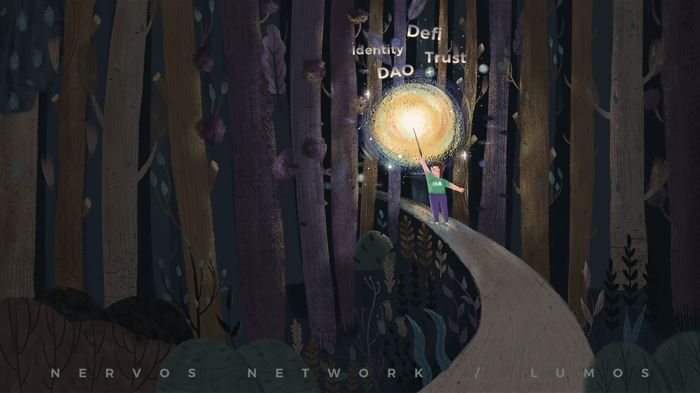

# lumos

Lumos is a full featured JavaScript/TypeScript based dapp framework for Nervos CKB. It aims to simplify dapp development on Nervos CKB. The [name](https://harrypotter.fandom.com/wiki/Lumos_Maxima) explains what the project is about: the wonderland of CKB, though vast and fertile, still remains dark in most of the parts, lumos tries to shed light upon the land, guiding people into this beautiful new world.

As of now, lumos contains the following components:

* [indexer](./packages/indexer): a CKB cell indexer that fulfills `Index-Query-Assemble` pattern. For now, this package only contains RocksDB backed indexer. A [separate package](./packages/sql-indexer) contains SQL backed indexer using the same interface. Later, we might merge the 2 packages into one for consistency.
* [base](./packages/base): a base package containing common types and utilities that are used by most packages. If there is a CKB specific task you need to perform, you might want to look here first. Chances are they are already provided.
* [helpers](./packages/helpers): a helper package containing more utilities. The difference between `helpers` and `base`, is that `base` contains pure stateless functions, while `helpers` works in a more intrinsic way: it requires `config-manager` mentioned below to be setup.
* [common-scripts](./packages/common-scripts): integrations for known scripts on CKB. While we try our best to provide integrations for popular CKB scripts, people might be working on innovations everyday. As a result, we are also designing a set of APIs, so developers can freely integrate their own scripts into lumos for everyone to use. One integrated, `common-scripts` should be able to leverage those new scripts as well.
* [config-manager](./packages/config-manager): a manager for dealing with differences between different chains, such as mainnet, testnet, or numerous dev chains. We abstract each chain into individual config file. Once loaded, config manager will be able to handle the chain specific logic, so you don't have to deal with this in your own code.
* [transaction-manager](./packages/transaction-manager): a transaction manager for CKB. One problem with UTXO based blockchains, is that a certain amount of gap period exists between a transaction is accepted by a blockchain, and when it is actually committed on chain. During this gap, new cells created by the pending transaction will not be available. Transaction manager package takes care of this. It wraps an indexer instance, and makes sure cells created in pending transactions, are also exposed and available for assembling new transactions. This means you are no longer bounded to one transaction at a time, you can freely send series of transactions as you wish.
