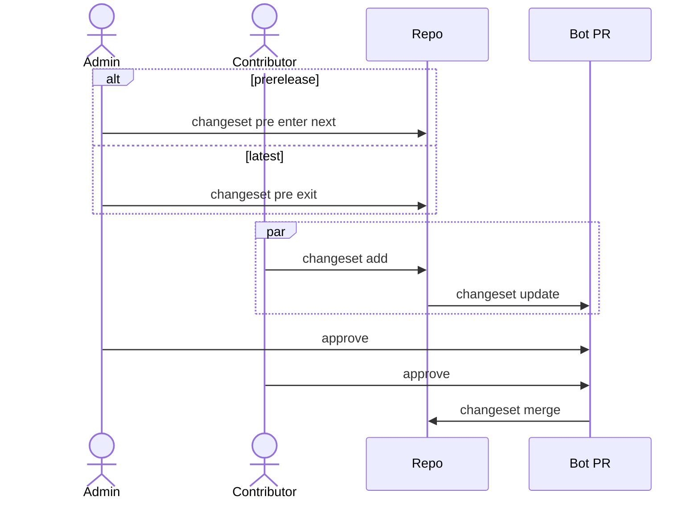

# DEVELOPMENT

## Changeset Workflow

Lumos is released using [changesets cli](https://github.com/changesets/changesets) and
[changesets action](https://github.com/changesets/action).



## To Admin

### Start New Prerelease Cycle

```sh
npx changeset pre enter next
```

### End Prerelease Cycle

```sh
npx changeset pre exit
```

A pull request titled **"Version Packages"** or **"Version Packages (next)"** will be automatically created by the bot after the above command's commit has been pushed to the `develop` branch.

## To Contributor

### Add Changeset

You can add one or more changesets when you open a pull request. Before `lumos@1.x` is released, you should treat a `minor` change as a `major` change.

### Add Changeset

When a change has been made, you can add a changeset by running the following command:

```sh
npx changeset add
```
