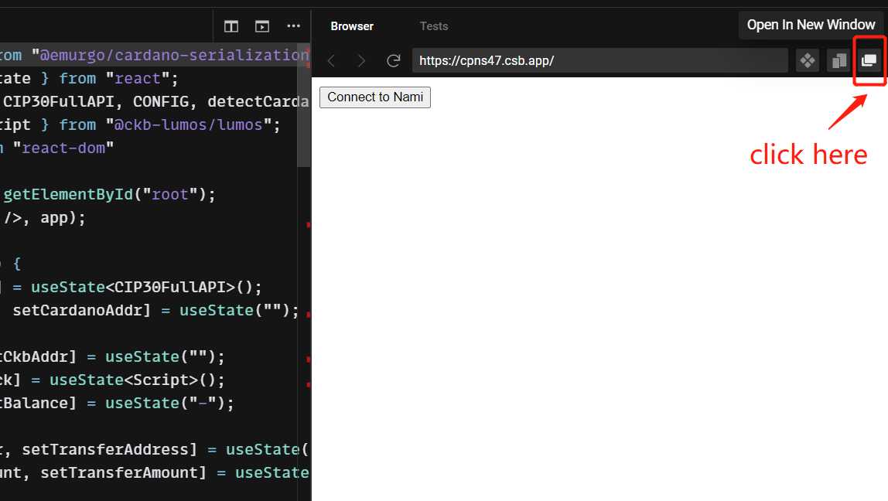

# Cardano lock NamiWallet

This is a simple example of how to interactive with CKB via [NamiWallet](https://github.com/Berry-Pool/nami-wallet)

## Deployment

- Aggron

| parameter   | value                                                                |
| ----------- | -------------------------------------------------------------------- |
| `code_hash` | `0x3625f5ccecdbb8edff6890db2225b0218d753b7932e144a41b0a77b1111c921b` |
| `hash_type` | `type`                                                               |
| `tx_hash`   | `0xadf72b5a58b18e3763ab9e7769e16ffcb222da07a2cae2b407a6ffc47a2d39ff` |
| `index`     | `0x0`                                                                |
| `dep_type`  | `code`                                                               |

## Reference

- [cardano lock spec](https://github.com/XuJiandong/docs-bank/blob/master/cardano_lock.md)

## Online Preview

Using [GitHubBox.com](https://codesandbox.io/docs/importing#using-githubboxcom), you can preview and interact with example code online through codesandbox.

Change the GitHub URL: https://github.com/nervosnetwork/lumos/tree/develop/examples/cardano-lock-namiwallet  
To: https://githubbox.com/nervosnetwork/lumos/tree/develop/examples/cardano-lock-namiwallet

Note that due to the incompatibility of namiwallet and iframe, you need to open the result in a new window:  

