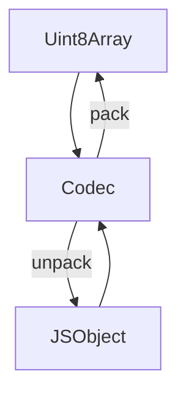
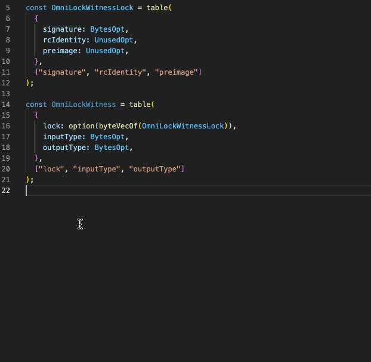

# @ckb-lumos/codec

This module provides a set of functions to pack(encode) and unpack(decode) data.



## Quick Start

```ts
import { struct, Uint8, Uint128 } from "@ckb-lumos/codec";

// udt-info.mol
// struct UDTInfo {
//  total_supply: Uint128,
//  decimals: Uint8,
// }
// array Uint8 [byte; 1];
// array Uint128 [byte; 16];

// 1. create molecule binding
const UDTInfo /*: Codec */ = struct(
  {
    totalSupply: Uint128,
    decimals: Uint8,
  },
  ["totalSupply", "decimals"]
);

// 2. usage
// 2.1 pack
const buf /*: Uint8Array*/ = UDTInfo.pack({
  totalSupply: BI.from(21000000 * 10 ** 8),
  decimals: 8,
});
// 2.2 unpack
const udtInfo = UDTInfo.unpack(buf); // { totalSupply: BI(21000000 * 10 ** 8), decimals: 8 }
```

## Molecule

[Molecule](https://github.com/nervosnetwork/molecule) is a lightweight serialization system that focuses only on the
layout of byte(s) and not on specific data types. This library will help developers to create TypeScript-friendly
molecule bindings in an easy way.

`layout` is a set of `Codec` that helps to bind molecule to JavaScript plain object/array.

- array: `Array<T>` <=> `Uint8Array`
- vector: `Array<T>` <=> `Uint8Array`
- struct: `{ [key: string]: T }` <=> `Uint8Array`
- table: `{ [key: string]: T }` <=> `Uint8Array`
- option: `T | undefined` <=> `Uint8Array`
- union: `{ type: string, value: T }` <=> `Uint8Array`

### Example

#### RGB Color

Suppose we want to describe an RGB color, then we can use a tuple3 of uint8 to describe the color

```mol
# color-by-tuple3.mol

array RGB [Uint8; 3];
```

```ts
const RGB = array(Uint8, 3);

const [r, g, b] = RGB.unpack(buffer);
// const unpacked = RGB.unpack(buffer)
// const r = unpacked[0];
// const g = unpacked[1];
// const b = unpacked[2];
```

Of course, we could also use a struct to more directly describe rgb separately

```mol
# color-by-struct.mol

struct RGB {
  r: Uint8,
  g: Uint8,
  b: Uint8,
}
```

```ts
const RGB = struct(
  { r: Uint8, g: Uint8, b: Uint8 },
  ["r", "g", "b"] // order of the keys needs to be consistent with the schema
);

const { r, g, b } = RGB.unpack(buffer);
// const unpacked = RGB.unpack(buffer);
// const r = unpacked.r;
// const g = unpacked.g;
// const b = unpacked.b;
```

## Number

`number` is a set of `Codec` that helps to encode/decode number to/from `Uint8Array`. Because of ckb-vm is a RISCV
machine, the number is encoded in little-endian by default.

- `Uint8(BE|LE)`: `number` <=> `Uint8`
- `Uint16(BE|LE)`: `number` <=> `Uint16`
- `Uint32(BE|LE)`: `number` <=> `Uint32`
- `Uint64(BE|LE)`: `BI` <=> `Uint64`
- `Uint128(BE|LE)`: `BI` <=> `Uint128`
- `Uint256(BE|LE)`: `BI` <=> `Uint256`
- `Uint512(BE|LE)`: `BI` <=> `Uint512`

```ts
import { Uint32, Uint128 } from "@ckb-lumos/codec";

const packedU32 = Uint32.pack(100); // == Uint8Array([100, 0, 0, 0]) little-endian
// const packedU32 = Uint32LE.pack(100); // == Uint8Array([100, 0, 0, 0]) little-endian
const packedU32BE = Uint32BE.pack(100); // == Uint8Array([0, 0, 0, 100]) big-endian

// unpack sUDT amount to a BI(BigInteger)
const sudtAmount = Uint128.unapck("0x0000e45d76a1f90e0c00000000000000"); // == BI.from('222440000000000000000')
// Uint8Array or Uint8Array are also supported
// Uint128.unpack(
//   Uint8Array.from([
//     0x00, 0x00, 0xe4, 0x5d,
//     0x76, 0xa1, 0xf9, 0x0e,
//     0x0c, 0x00, 0x00, 0x00,
//     0x00, 0x00, 0x00, 0x00,
//   ])
// );
```

## Custom Codec

When we encounter molecule layouts like `byte` | `array SomeBytes [byte; n]` | `vector SomeBytes <byte>`, and the common
codec is not sufficient, we can customize the codec to help us interpret these byte(s)

Let's see an example of how to implement a `UTF8String` codec. If we want to store a UTF8String of indefinite length,
then the corresponding molecule structure should be a `vector UTF8String <byte>`

```ts
import { byteVecOf, bytes } from "@ckb-lumos/codec";
import { Buffer } from "buffer"; // https://github.com/feross/buffer

const UTF8String = byteVecOf<string>({
  pack: (str) => {
    return Uint8Array.from(Buffer.from(str, "utf8")).buffer;
  },
  unpack: (buf) => {
    return Buffer.from(bytes.bytify(buf)).toString("utf8");
  },
});
```

## Why I Need This Module

molecule is flexible in that it is a serialization scheme that focuses only on byte(s) layout. When developers
encounter `byte` | `array FixedBytes [byte; n]` | `vector DynBytes <byte>`, these byte(s) need to be translated into
understandable data types, such as `array Uint32 [byte; 4]` is generally translated as `number`.

This module can help us convert bytes to common data types in a simple way. If you have some experience with CKB, you
will have encountered more complex scripts
like [OmniLock](https://github.com/nervosnetwork/rfcs/blob/master/rfcs/0042-omnilock/0042-omnilock.md), where it is easy to get confused
about how to handle bytes when we want to sign it, if we can combine `WitnessArgs.lock(BytesOpt)`
with `OmniLockWitnessLock.signature(BytesOpt)`, then it will be easier to do the signing, we can check
[the real world OmniLock witness case](./tests/blockchain.test.ts) to see how it works

```mol
table WitnessArgs {
    lock:                   BytesOpt,          // Lock args
    inputType:             BytesOpt,          // Type args for input
    outputType:            BytesOpt,          // Type args for output
}

table OmniLockWitnessLock {
    signature: BytesOpt,
    rc_identity: RcIdentityOpt,
    preimage: BytesOpt,
}
```



## Works with TypeScript

### Get Type Definition from Value

```ts
import { molecule } from "@ckb-lumos/codec";
import type { UnpackResult } from "@ckb-lumos/codec";

const { struct } = molecule;

const RGB = struct(
  { r: Uint8, g: Uint8, b: Uint8 },
  ["r", "g", "b"] // order of the keys needs to be consistent with the schema
);

// We don't need to repeat the definition like this
// type UnpackedRGB = { r: number; g: number; b: number };
type UnpackedRGB = UnpackResult<typeof RGB>;
```
