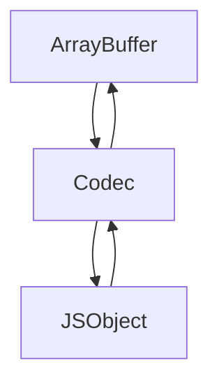

# @ckb-lumos/molecule

[Molecule](https://github.com/nervosnetwork/molecule) is a lightweight serialization system that focuses only on the
layout of byte(s) and not on specific data types. This library will help developers to create TypeScript-friendly
molecule bindings in an easy way.



## Quick Start

```ts
import { layout, common } from "@ckb-lumos/experiment-molecule";

const { table } = layout;
const { Uint8, Uint128, UTF8String } = common;

// table UDTInfo {
//  total_supply: Uint128,
//  name: UTF8String,
//  symbol: UTF8String,
//  decimals: Uint8,
// }
// array Uint8 [byte; 1];
// array Uint128 [byte; 16];
// vector UTF8String <byte>;

// 1. create molecule binding
const UDTInfo /*: Codec */ = table(
  {
    totalSupply: Uint128LE,
    name: UTF8String,
    symbol: UTF8String,
    decimals: Uint8,
  },
  ["totalSupply", "name", "symbol", "decimals"]
);

// 2. usage
const buf /*: ArrayBuffer*/ = UDTInfo.pack({
  totalSupply: BI.from(21000000 * 10 ** 8),
  name: "Fake BitCoin",
  symbol: "FBTC",
  decimals: 8,
});
```

## Layout

`layout` is a set of `Codec` that helps to bind molecule to JavaScript plain object/array

- array: `Array<T>` <=> `ArrayBuffer`
- vector: `Array<T>` <=> `ArrayBuffer`
- struct: `{ [key: string]: T }` <=> `ArrayBuffer`
- table: `{ [key: string]: T }` <=> `ArrayBuffer`
- option: `T | undefined` <=> `ArrayBuffer`
- union: `{ type: string, value: T }` <=> `ArrayBuffer

## Common

`common` is a set of `Codec` that helps to bind molecule to familiar JavaScript data types.

For more details, please check the [common mocule](./src/common.ts)

```ts
Uint32.pack(100); // ArrayBuffer([100, 0, 0, 0])
```

## Why I Need This Module

molecule is flexible in that it is a serialization scheme that focuses only on byte(s) layout. When developers
encounter `byte` | `array FixedBytes [byte; n]` | `vector DynBytes <byte>`, these byte(s) need to be translated into
understandable data types, such as `array Uint32 [byte; 4]` is generally translated as `number`.

This package can help us convert bytes to common data types in a simple way. If you have some experience with CKB, you
will have encountered more complex scripts like Omni Lock, where it is easy to get confused about how to handle bytes
when we want to sign it, if we can combine `WitnessArgs.lock(BytesOpt)` with `RcLockWitnessLock.signature(BytesOpt)`,
then it will be easier to do the signing, we can check
the [test case('a real world Omni Lock witness should work as expected')](./tests/common.test.ts) to see how it works

```mol
table WitnessArgs {
    lock:                   BytesOpt,          // Lock args
    input_type:             BytesOpt,          // Type args for input
    output_type:            BytesOpt,          // Type args for output
}

table RcLockWitnessLock {
    signature: BytesOpt,
    rc_identity: RcIdentityOpt,
    preimage: BytesOpt,
}
```
