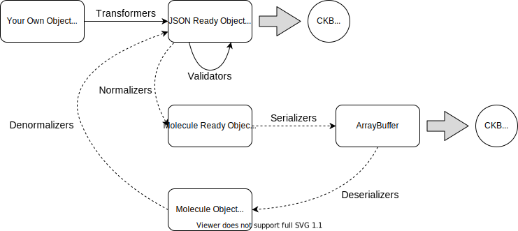

ckb-js-toolkit
==============

JavaScript toolkit for Nervos CKB. It contains a series of independent tools that can aid develoment of CKB dapps. This is different from a normal CKB SDK, since it tries to minimize the work done in an SDK, while providing more utlities that could be handy.

# Design Goals

The toolkit here is built with specific design goals, if some of the design feels quirky to you, you might want to revisit this section to see if there is some tradeoff involved.

## Version Stability

One design goal here is the stability of the toolkit, meaning the toolkit version you use can stay unchanged unless one of the following conditions is met:

* A security vulnerability occurs
* A fork happens in CKB

## Code Compatibility

In the meantime, we also want to ensure code compatibility: we might upgrade the toolkit from time to time with new features. But when you are upgrading the toolkit version, you shouldn't expect any code breaks. Sometimes this might be infeasible, such as when security bugs or forks happen, but for the vast majority of the changes, we do want to ensure code compatibility at all costs.

And before you ask, personally I don't trust in [Semantic Versioning](https://semver.org/). I do want to ensure code compatibility with all my efforts regardless of the specific part changed in the version number.

## Runtime type checking

This might be a controversial one: with the whole JavaScript world moving into static typed languages such as TypeScript, ReasonML, etc. I'm building the toolkit here with plain JavaScript doing runtime type checking. This is because none of existing static typed languages in the JavaScript world provide decent type checking stories when you are calling the code from JavaScript. I've seen too many times that a piece of code runs `JSON.parse` on some user input data, then cast the resulting object directly to a TypeScript object, ignoring all the interface checks. If all you use in TypeScript in your project, that won't be a problem, but for a CKB Toolkit built for JavaScript, not TypeScript, nor ReasonML. I want to consider the case that some people would want to use JavaScript directly to call the code in the toolkit. That's why I'm opting for pure JavaScript in this project with runtime checking code. Speed is not much of a concern here, security is a huge concern.

In the future we might certainly provide TypeScript typing files(and maybe also ReasonML definition files), but that is just a different metric. Runtime type checking is still a critical aspect in this project.

# Table Of Contents

* [RPC](#rpc)
* [Reader](#reader)
* [Utility Functions](#utility-functions)
    + [Validators](#validators)
    + [Transformers](#transformers)
    + [Normalizers](#normalizers)
* [Cell Collectors](#cell-collectors)

# RPC

RPC class provides a way to make RPC calls directly to CKB. It works by utilizing [Proxy object](https://developer.mozilla.org/en-US/docs/Web/JavaScript/Reference/Global_Objects/Proxy) so the toolkit can cope with new RPCs naturally in CKB. This is an example of `Code Compatibility` design goal.

```
node --experimental-repl-await
Welcome to Node.js v13.9.0.
Type ".help" for more information.
> const toolkit = require("ckb-js-toolkit")
> const rpc = new toolkit.RPC("http://127.0.0.1:9115/rpc")
> await rpc.get_blockchain_info()
{
  alerts: [],
  chain: 'ckb',
  difficulty: '0x5bb23548f6795',
  epoch: '0x708047900028b',
  is_initial_block_download: true,
  median_time: '0x170aee25ea5'
}
> await rpc.get_tip_header()
{
  compact_target: '0x1a2cab56',
  dao: '0x1a7930d4812eeb308acafdfe3cf1230088a770976aef78000032f12fbd5f0107',
  epoch: '0x708047900028b',
  hash: '0x1d0c693d8a78c9e2294ac7304934c635d7b65274fcdf46d5ce3d13ed66768cfd',
  nonce: '0xe2b8ce400000000000000194cf350200',
  number: '0xfcaf2',
  parent_hash: '0x9cf27f050122efb35c362d105d980062d8ea29a8e0f86ec6a4ea06178a5a0381',
  proposals_hash: '0x0000000000000000000000000000000000000000000000000000000000000000',
  timestamp: '0x170aee486ee',
  transactions_root: '0x16c74b3272430f1a89bb2fca39a571bf7a1bffecb314de528b6cbe9ba0f5d280',
  uncles_hash: '0x0000000000000000000000000000000000000000000000000000000000000000',
  version: '0x0'
}
> await rpc.get_header_by_number("0x12")
{
  compact_target: '0x1a08a97e',
  dao: '0x18a6312eb520a12e8e552ee0f286230026c8799e8500000000bc29f1c9fefe06',
  epoch: '0x6cf0012000000',
  hash: '0xbc00f447149004a38a8f7347dcd0a2050a2f10f4b926325d797c0f3e0d10f99b',
  nonce: '0x93317ca10000055400000000ba7e0100',
  number: '0x12',
  parent_hash: '0x4a191e12132587e852ddc30c73008426da6322a7def06ee153682afdceab16e7',
  proposals_hash: '0x0000000000000000000000000000000000000000000000000000000000000000',
  timestamp: '0x16e71002eff',
  transactions_root: '0xcc05a6b1fc20464d4f07a40611f2cab00618ff66cc271ccee9a9fe5b4ea96a45',
  uncles_hash: '0x0000000000000000000000000000000000000000000000000000000000000000',
  version: '0x0'
}
```

Please refer to [CKB's RPC documentation](https://github.com/nervosnetwork/ckb/tree/develop/rpc) for more details on different RPCs. All values accepted by the RPC module has to be JSON ready values(such as hex strings or objects) following CKB's JSONRPC formatting rules. See [Validators](#validators) and [Transformers](#transformers) sections below on how the toolkit can aid the conversion work.

# Reader

Reader class serves a unique purpose: depending on sources of data, we might get values in different formats:

* Hex string might be provided in CKB RPC responses
* ArrayBuffer might be provided by CKB syscalls
* Raw string might also be used for coding convenience

One big question, is how we can manage all those different data formats? How can we ensure we can convert them to the correct hex format beforing sending them to CKB's RPC? Reader class serves this purpose:

```
node --experimental-repl-await
Welcome to Node.js v13.9.0.
Type ".help" for more information.
> const toolkit = require("ckb-js-toolkit");
undefined
> const { Reader } = toolkit;
undefined
> const reader1 = new Reader("0x31323334")
undefined
> const arraybuffer = new ArrayBuffer(4)
undefined
> const view = new DataView(arraybuffer)
undefined
> view.setUint8(0, 0x31)
undefined
> view.setUint8(1, 0x32)
undefined
> view.setUint8(2, 0x33)
undefined
> view.setUint8(3, 0x34)
undefined
> const reader2 = new Reader(arraybuffer)
undefined
> const reader3 = Reader.fromRawString("1234")
undefined
> reader1.serializeJson()
'0x31323334'
> reader2.serializeJson()
'0x31323334'
> reader3.serializeJson()
'0x31323334'
```

Here we are setting `reader1`, `reader2` and `reader3` using differnet methods, the result here stays the same no matter what format the source data uses. Later in the [Transformers](#transformers) section we will see how we can combine Reader with transformers for a unified coding experience.

# Utility Functions

The toolkit doesn't provide pre-defined models on common constructs. Instead, it is defined to let you have your own model, and work with it. For example, typical Web project probably has models defined from an ORM over a SQL database. I don't want you to have both a cell data structure defined in your ORM, and in the toolkit. We wanta to take a different path here: you only need to define the data structure once, whether it's defined from an ORM, or defined as an ECMAScript class with methods customed to your project. All you need to do, is to follow rules defined by transformers, you will be able to use the utility functions defined here.

The diagram below illustrates the relations between the utility functions:



`Normalizers`, `Transformers` and `Validators` are included in this repository. `Denormalizers` are kept in the more experimental [ckb-js-toolkit-contrib](https://github.com/xxuejie/ckb-js-toolkit-contrib) project for now, and might be moved here once it is stablized. `Serializers` and `Deserializers` refer to JavaScript source generated by the [moleculec-es](https://github.com/xxuejie/moleculec-es) project. In most cases, you don't have to use `moleculec-es` directly, a ready-to-use file has been put in [ckb-js-toolkit-contrib](https://github.com/xxuejie/ckb-js-toolkit-contrib/blob/master/src/blockchain.js).

There is one exception here: `Deserializers` are not functions actually, they are [classes](https://github.com/xxuejie/ckb-js-toolkit-contrib/blob/747db7616116a3d5511f633f71b0415b53e83060/src/blockchain.js#L691) that is constructed from ArrayBuffer to better leverage molecule's zero copy design.

You might also notice there is no conversions from JSON Ready Object to objects in your own data structures. This part will have to be implemented by yourself if needed.

## Validators

### Overview

Validator is an example of the `Runtime type checking` design goal, it provides a series of functions are provided here to validate that a JSON object follows required format for a CKB data structure, such as script, outpoint, transaction, block, etc. So when you have prepared the values required by the RPC class, you can pass the value through the validators here, to ensure they are of the correct format.

First, let's look at one example:

```
node --experimental-repl-await
Welcome to Node.js v13.9.0.
Type ".help" for more information.
> const toolkit = require("ckb-js-toolkit")
> const rpc = new toolkit.RPC("http://127.0.0.1:9115/rpc")
> const transaction = (await rpc.get_transaction("0x71a7ba8fc96349fea0ed3a5c47992e3b4084b031a42264a018e0072e8172e46c")).transaction
> toolkit.validators.ValidateTransaction(transaction)
Uncaught:
Error: transaction does not have correct keys! Required keys: [cell_deps, header_deps, inputs, outputs, outputs_data, version, witnesses], optional keys: [], actual keys: [cell_deps, hash, header_deps, inputs, outputs, outputs_data, version, witnesses]
> delete transaction.hash
> transaction
{
  cell_deps: [
    { dep_type: 'code', out_point: [Object] },
    { dep_type: 'code', out_point: [Object] }
  ],
  header_deps: [],
  inputs: [ { previous_output: [Object], since: '0x0' } ],
  outputs: [
    { capacity: '0x2b95fd500', lock: [Object], type: null },
    { capacity: '0x2b95fd500', lock: [Object], type: null }
  ],
  outputs_data: [
    '0x02000000e2fb199810d49a4d8beec56718ba2593b665db9d52299a0f9e6e75416d73ff5c03000000e2fb199810d49a4d8beec56718ba2593b665db9d52299a0f9e6e75416d73ff5c01000000',
    '0x02000000e2fb199810d49a4d8beec56718ba2593b665db9d52299a0f9e6e75416d73ff5c03000000e2fb199810d49a4d8beec56718ba2593b665db9d52299a0f9e6e75416d73ff5c04000000'
  ],
  version: '0x0',
  witnesses: [
    '0x3ed693609d3ff7049415d33a2fff8eed581cf2790fae4785e27793330cfd55a6109b84a94494eae64217339bc9aafdf4e6453964c90e6752d96e20d127ca874901'
  ]
}
> toolkit.validators.ValidateTransaction(transaction)
undefined
> transaction.outputs[1].lock.args = 123
123
> toolkit.validators.ValidateTransaction(transaction)
Uncaught Error: transaction.outputs[1].lock.args must be a hex string!
    at nt (/home/ubuntu/code/ckb-js-toolkit/dist/ckb-js-toolkit.node.js:1:46599)
    at st (/home/ubuntu/code/ckb-js-toolkit/dist/ckb-js-toolkit.node.js:1:47003)
    at lt (/home/ubuntu/code/ckb-js-toolkit/dist/ckb-js-toolkit.node.js:1:47614)
    at /home/ubuntu/code/ckb-js-toolkit/dist/ckb-js-toolkit.node.js:1:48132
    at ct (/home/ubuntu/code/ckb-js-toolkit/dist/ckb-js-toolkit.node.js:1:48073)
    at ht (/home/ubuntu/code/ckb-js-toolkit/dist/ckb-js-toolkit.node.js:1:48343)
    at Object.dt [as ValidateTransaction] (/home/ubuntu/code/ckb-js-toolkit/dist/ckb-js-toolkit.node.js:1:48755)
```

From the example above, we can deduce some insights:

* Validator function will check if given object has correct keys for each field required in the object. For example, a transaction object do not need `hash` field, but CKB's RPC response contains this field, hence the first validator invocation fails. Later when we delete the `hash` key, the object passes all validation.
* By default validator function recursively check all fields to make sure they follow the correct format. In the above example, the validator would signal error when we change `args` field of one output's lock script to `123`, which is an invalid value. You will also notice that the error message generated in this case is: `transaction.outputs[1].lock.args must be a hex string!`, it contains the full path of the error value: `transaction.outputs[1].lock.args`.

Notice you are not required to use validator functions in your dapp: if you are familiar with CKB's data structure, you are perfectly good ignoring all validator functions, and ensure the objects are in correct format yourself. But I personally I believe validators are gonna be a very handy component in your toolbox when you run into formatting errors in your dapp.

### Function prototypes

For each CKB data structure, we have prepared a validator function, which means right now the following functions are available:

* [ValidateScript](https://github.com/xxuejie/ckb-js-toolkit/blob/48eb43f10da07d30ebc9411c7a0714905ef9164f/src/validators.js#L65)
* [ValidateOutPoint](https://github.com/xxuejie/ckb-js-toolkit/blob/48eb43f10da07d30ebc9411c7a0714905ef9164f/src/validators.js#L83)
* [ValidateCellInput](https://github.com/xxuejie/ckb-js-toolkit/blob/48eb43f10da07d30ebc9411c7a0714905ef9164f/src/validators.js#L92)
* [ValidateCellOutput](https://github.com/xxuejie/ckb-js-toolkit/blob/48eb43f10da07d30ebc9411c7a0714905ef9164f/src/validators.js#L106)
* [ValidateCellDep](https://github.com/xxuejie/ckb-js-toolkit/blob/48eb43f10da07d30ebc9411c7a0714905ef9164f/src/validators.js#L125)
* [ValidateRawTransaction](https://github.com/xxuejie/ckb-js-toolkit/blob/48eb43f10da07d30ebc9411c7a0714905ef9164f/src/validators.js#L195)
* [ValidateTransaction](https://github.com/xxuejie/ckb-js-toolkit/blob/48eb43f10da07d30ebc9411c7a0714905ef9164f/src/validators.js#L215)
* [ValidateRawHeader](https://github.com/xxuejie/ckb-js-toolkit/blob/48eb43f10da07d30ebc9411c7a0714905ef9164f/src/validators.js#L255)
* [ValidateHeader](https://github.com/xxuejie/ckb-js-toolkit/blob/48eb43f10da07d30ebc9411c7a0714905ef9164f/src/validators.js#L279)
* [ValidateUncleBlock](https://github.com/xxuejie/ckb-js-toolkit/blob/48eb43f10da07d30ebc9411c7a0714905ef9164f/src/validators.js#L316)
* [ValidateBlock](https://github.com/xxuejie/ckb-js-toolkit/blob/48eb43f10da07d30ebc9411c7a0714905ef9164f/src/validators.js#L335)
* [ValidateCellbaseWitness](https://github.com/xxuejie/ckb-js-toolkit/blob/48eb43f10da07d30ebc9411c7a0714905ef9164f/src/validators.js#L371)
* [ValidateWitnessArgs](https://github.com/xxuejie/ckb-js-toolkit/blob/48eb43f10da07d30ebc9411c7a0714905ef9164f/src/validators.js#L385)

Each validator function uses exactly the same function prototype as below:

```js
function validate(value, { nestedValidation = true, debugPath = "" } = {})
```

`value` here contains the JSON object to check against. `nestedValidation` controls if nested validation is performed. For example, when you are validating the structure of a transaction, you can use this flag to control whether you want to validate transaction itself, or if you want to do recursive validation on all the included fields, such as inputs, outputs, etc. `debugPath` here is a value used to generate full value path in error messages, in 99% of the cases, you can safely ignore this value and just use the default ones.

The validator functions here would throw errors in case validation fails, otherwise the validation is considered successful. Return values of vaildator functions shall not be used.

## Transformers

### Overview

Transformer also provides a series of functions much like validators do, but transformers serve a different purpose: while RPC accepts JSON ready values such as strings or plain objects, you might not want the same thing in your dapps. Chances are you have some custom classes that wrap a CKB cell or even a CKB transaction, and will need separate processing work to transform the values into the final formats. Another case might be that you are leveraging the Reader class introduced above a lot, and you need to transform the very inner `args` part of cell outputs in your current transaction before you can send it to the RPC. Transformers fill in exactly this role: they help us transform custom data formats following a very single rule to the formats acceptable by CKB RPCs. This might sound quite abstract here, let's also look at one example. First, let's prepare a supporting commonjs JavaScript file:

```
$ cat << EOF > test.js
class Script {
  constructor(code_hash, args) {
    this.code_hash = code_hash;
    this.args = args;
  }

  serializeJson() {
    return {
      code_hash: this.code_hash,
      hash_type: "data",
      args: this.args
    };
  }
}

module.exports = Script;
EOF
```

Here we are defining a custom class wrapping Script. We can now see how transformers will help us use the wrapper class:

```
node --experimental-repl-await
Welcome to Node.js v13.9.0.
Type ".help" for more information.
> const toolkit = require("ckb-js-toolkit");
undefined
> const Script = require("./test.js");
undefined
> const script = new Script(new toolkit.Reader("0x71a7ba8fc96349fea0ed3a5c47992e3b4084b031a42264a018e0072e8172e46c"), "0x")
undefined
> script
Script {
  code_hash: a {
    string: '0x71a7ba8fc96349fea0ed3a5c47992e3b4084b031a42264a018e0072e8172e46c'
  },
  args: '0x'
}
> toolkit.validators.ValidateScript(script)
Uncaught:
Error: script does not have correct keys! Required keys: [args, code_hash, hash_type], optional keys: [], actual keys: [args, code_hash]
> const transformedScript = toolkit.transformers.TransformScript(script)
undefined
> transformedScript
{
  code_hash: '0x71a7ba8fc96349fea0ed3a5c47992e3b4084b031a42264a018e0072e8172e46c',
  hash_type: 'data',
  args: '0x'
}
> toolkit.validators.ValidateScript(transformedScript)
undefined
```

If we pass objects instantiated from Script class directly, validator functions will fail, and so will CKB RPC(even if we haven't tested it here). However, if we pass the objects into transformer functions, the transformed value will have the correct format required by CKB's RPC. This shows that you can use whatever data format you want in your dapp, as long as it can be transformed to correct format by the transformers, you can largely ignore CKB's format rules in your dapp.

Of course, not any format can be transformed by transformer functions here. You might already noticed the `serializeJson` function included in the `Script` class, this is exactly how transformer functions work on. What's not so obvious, here, is that transformer functions will recursively invoke `serializeJson` on nested entities to make sure all sub-fields are also transformed properly. For example, the `code_hash` passed to Script object here, is actually a Reader instance, while `serializeJson` of Script class ignored the type of `code_hash`, transformer functions also perform the necessary transformation, which converts Reader object into hex strings.

Unlike validators, we expect you to heavily rely on transformers in your dapps. These days it will be very unlikely that people use plain old JavaScript objects to store data, we tend to use all kinds of abstractions that help us organize our code better.

### Function prototypes

For each CKB data structure, we have prepared a transformer function, which means right now the following functions are available:

* [TransformScript](https://github.com/xxuejie/ckb-js-toolkit/blob/48eb43f10da07d30ebc9411c7a0714905ef9164f/src/transformers.js#L44)
* [TransformOutPoint](https://github.com/xxuejie/ckb-js-toolkit/blob/48eb43f10da07d30ebc9411c7a0714905ef9164f/src/transformers.js#L62)
* [TransformCellInput](https://github.com/xxuejie/ckb-js-toolkit/blob/48eb43f10da07d30ebc9411c7a0714905ef9164f/src/transformers.js#L88)
* [TransformCellOutput](https://github.com/xxuejie/ckb-js-toolkit/blob/48eb43f10da07d30ebc9411c7a0714905ef9164f/src/transformers.js#L105)
* [TransformCellDep](https://github.com/xxuejie/ckb-js-toolkit/blob/48eb43f10da07d30ebc9411c7a0714905ef9164f/src/transformers.js#L123)
* [TransformRawTransaction](https://github.com/xxuejie/ckb-js-toolkit/blob/48eb43f10da07d30ebc9411c7a0714905ef9164f/src/transformers.js#L148)
* [TransformTransaction](https://github.com/xxuejie/ckb-js-toolkit/blob/48eb43f10da07d30ebc9411c7a0714905ef9164f/src/transformers.js#L169)
* [TransformRawHeader](https://github.com/xxuejie/ckb-js-toolkit/blob/48eb43f10da07d30ebc9411c7a0714905ef9164f/src/transformers.js#L191)
* [TransformHeader](https://github.com/xxuejie/ckb-js-toolkit/blob/48eb43f10da07d30ebc9411c7a0714905ef9164f/src/transformers.js#L216)
* [TransformUncleBlock](https://github.com/xxuejie/ckb-js-toolkit/blob/48eb43f10da07d30ebc9411c7a0714905ef9164f/src/transformers.js#L242)
* [TransformBlock](https://github.com/xxuejie/ckb-js-toolkit/blob/48eb43f10da07d30ebc9411c7a0714905ef9164f/src/transformers.js#L259)
* [TransformCellbaseWitness](https://github.com/xxuejie/ckb-js-toolkit/blob/48eb43f10da07d30ebc9411c7a0714905ef9164f/src/transformers.js#L278)
* [TransformWitnessArgs](https://github.com/xxuejie/ckb-js-toolkit/blob/48eb43f10da07d30ebc9411c7a0714905ef9164f/src/transformers.js#L295)

Each transformer function uses exactly the same function prototype as below:

```js
function transform(value, { validation = true, debugPath = "" } = {})
```

`value` here contains the value to perform transformation(see next section for transformation rules). `validation` controls if validators should also be called after transformation. `debugPath` works like the same value in validators, and could safely be ignored in 99% of the cases.

### Transformation Rules

Transformer functions use the following transformation rules:

* If the provide value is an object with method `serializeJson`, invoke the method and use the return value to replace provided value;
* Check if the value is an object, throw error if it is not;
* Remove all extra keys that should not exist for the type of current value object;
* For each field in the object, apply the transformation rules recursively.

### Note on Reader class

We have already provided `serializeJson` method for all instances of the Reader class, that means you can freely use Reader class in your code. As long as you apply transformer functions before sending the values to CKB RPC, all the Reader objects will be transformed to correct hex strings.

## Normalizers

### Overview

Normalizers serve a different purpose: in addition to the molecule serialization format, CKB still encodes certain domain specific knowledge to interpret the data. This brings a gap between the JSON data structure used in CKB RPC, and the molecule serialized formats used internally. If you are only using CKB RPC, you probably will not use this package, but if you need to work with CKB in a deeper level(for example, if you are writing a smart contract in JavaScript), chances are you might need this package.

A sample usage for this package can be seen in the included [tests](https://github.com/xxuejie/ckb-js-toolkit/blob/master/tests/serializers.js). A normalizer function takes plain JavaScript object that can be validated by validator function, it then emits another transformed plain JavaScript object which can be serialized by [moleculec-es](https://github.com/xxuejie/moleculec-es) into serialized ArrayBuffer data in molecule format.

### Function prototypes

For each CKB data structure, we have prepared a normalizer function, which means right now the following functions are available:

* [NormalizeScript](https://github.com/xxuejie/ckb-js-toolkit/blob/d17eda8dc41689b14913500332085d9a9ae85a01/src/normalizers.js#L71)
* [NormalizeOutPoint](https://github.com/xxuejie/ckb-js-toolkit/blob/d17eda8dc41689b14913500332085d9a9ae85a01/src/normalizers.js#L92)
* [NormalizeCellInput](https://github.com/xxuejie/ckb-js-toolkit/blob/d17eda8dc41689b14913500332085d9a9ae85a01/src/normalizers.js#L107)
* [NormalizeCellOutput](https://github.com/xxuejie/ckb-js-toolkit/blob/d17eda8dc41689b14913500332085d9a9ae85a01/src/normalizers.js#L117)
* [NormalizeCellDep](https://github.com/xxuejie/ckb-js-toolkit/blob/d17eda8dc41689b14913500332085d9a9ae85a01/src/normalizers.js#L133)
* [NormalizeRawTransaction](https://github.com/xxuejie/ckb-js-toolkit/blob/d17eda8dc41689b14913500332085d9a9ae85a01/src/normalizers.js#L161)
* [NormalizeTransaction](https://github.com/xxuejie/ckb-js-toolkit/blob/d17eda8dc41689b14913500332085d9a9ae85a01/src/normalizers.js#L175)
* [NormalizeRawHeader](https://github.com/xxuejie/ckb-js-toolkit/blob/d17eda8dc41689b14913500332085d9a9ae85a01/src/normalizers.js#L189)
* [NormalizeHeader](https://github.com/xxuejie/ckb-js-toolkit/blob/d17eda8dc41689b14913500332085d9a9ae85a01/src/normalizers.js#L207)
* [NormalizeUncleBlock](https://github.com/xxuejie/ckb-js-toolkit/blob/d17eda8dc41689b14913500332085d9a9ae85a01/src/normalizers.js#L218)
* [NormalizeBlock](https://github.com/xxuejie/ckb-js-toolkit/blob/d17eda8dc41689b14913500332085d9a9ae85a01/src/normalizers.js#L228)
* [NormalizeCellbaseWitness](https://github.com/xxuejie/ckb-js-toolkit/blob/d17eda8dc41689b14913500332085d9a9ae85a01/src/normalizers.js#L237)
* [NormalizeWitnessArgs](https://github.com/xxuejie/ckb-js-toolkit/blob/d17eda8dc41689b14913500332085d9a9ae85a01/src/normalizers.js#L247)

Each normalizer function uses exactly the same function prototype as below:

```js
function transform(value, { debugPath = "" } = {})
```

`value` here contains the value which can be validated by corresponding validator function. `debugPath` works like the same value in validators, and could safely be ignored in 99% of the cases.

# Cell Collectors

One extremely typical tasks in CKB, is to index and query cells with certain properties, such as live cells with the same lock script hash. Cell collectors has been provided in the toolkit to aid this task.

As usual, first let's see an example:

```
node --experimental-repl-await
Welcome to Node.js v13.9.0.
Type ".help" for more information.
> const toolkit = require("ckb-js-toolkit");
undefined
> const rpc = new toolkit.RPC("http://127.0.0.1:9115/rpc")
undefined
> const collector = new toolkit.cell_collectors.RPCCollector(rpc, "0x7c7232c0af4a7261674a45e14916f926ecec64b911f539e573fb4bb7817d001e")
undefined
> for await (const cell of collector.collect()) { console.log(cell); }
{
  cell_output: {
    capacity: '0x3faa252260000',
    lock: {
      args: '0xfa3afa2134319f9471cf21024f032831bc4651ad',
      code_hash: '0x9bd7e06f3ecf4be0f2fcd2188b23f1b9fcc88e5d4b65a8637b17723bbda3cce8',
      hash_type: 'type'
    },
    type: null
  },
  out_point: {
    index: '0x7',
    tx_hash: '0xe2fb199810d49a4d8beec56718ba2593b665db9d52299a0f9e6e75416d73ff5c'
  },
  block_hash: '0x92b197aa1fba0f63633922c61c92375c9c074a93e85963554f5499fe1450d0e5',
  data: null,
  block_number: '0x0'
}
```

Here we are using [RPCCollector](https://github.com/xxuejie/ckb-js-toolkit/blob/master/src/cell_collectors/rpc_collector.js) to scan CKB via RPCs, and gather all live cells satisfying a given lock script hash. Notice [async iterator](https://developer.mozilla.org/en-US/docs/Web/JavaScript/Reference/Global_Objects/Symbol/asyncIterator) is leveraged here to provide a clean API to the end users.

## Collector Interface

A cell collector should satisfy the following rules:

* It should provide a `collect` method that returns an async iterator;
* The async iterator should generate plain JavaScript objects with the following fields:
    + `cell_output`: CellOutput object that can be validated by `ValidateCellOutput`
    + `out_point`: OutPoint object that can be validated by `ValidateOutPoint`
    + `block_hash`: A 66-byte long hex string containing block header hash
    * `data`: An optional hex string containing cell data, depending on the specific cell collector, this could be omitted, in which case `null` should be used here.

In the above example we are only showing RPCCollector, there might be many different implementations of cell collectors, assuming they satisfy the above rules. In the future we might add more cell collector implementations here, and you are also welcome to create your own implementations of cell collectors.

One additional note here, is that even though RPCCollector above only gathers cells with the same lock script hash, this is not the case for your custom cell collectors. The only true requirement of a cell collector, is the async iterator interface. You can use any filtering logic in your cell collector, for example, you can gather by type script hash, or by lock script code hash, or you can even call external services, such as [animagus](https://github.com/xxuejie/animagus) to provide you with the cells to use.

## Collector Index

### RPCCollector

RPCCollector uses [get_cells_by_lock_hash](https://github.com/nervosnetwork/ckb/tree/develop/rpc#get_cells_by_lock_hash) to fetch matched live cells via CKB RPC. It only allows fetching live cells matching provided lock script hash, and can be controlled to either provide or omit cell data.

Note RPCCollector is a naive implementation, meaning it would do the full scanning every time you call `collect`. This means it could be quite slow, and you should never use it in production. It is only used here for demostration purposes.
