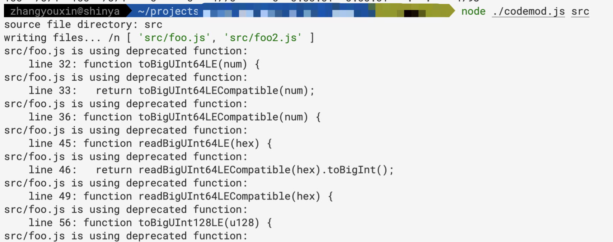

# Migration to Lumos 0.19

Migrate from `lumos@0.18` or earlier to `lumos@0.19`

1. changed all snake_case to camelCase
2. deprecated the `@ckb-lumos/toolkit` and replaced with `@ckb-lumos/codec`
3. deprecated `readBigUintX` in `@ckb-lumos/base`

## Step-by-Step Guide

### Step 1 - Codemod

**WARNING**: Running the codemod will change your source code, please make sure your code are has been committed.

Running the codemod will:

1. change your lumos-related API from snake_case to camelCase.
2. show warnings for deprecated functions.

```sh
curl -s https://gist.githubusercontent.com/zhangyouxin/e5ddf9b966f611173a01d6c98715c931/raw/30606c12756a866437a390add8dc5f5df47c9c36/codemod.js \
| xargs -0 -I{} node -e {} "your-source-dir/**/*.js"
```

The output should look like: 

Then check out the changes by `git status` and `git diff` and make sure the code diff is within expectation.

The warnings logged in console indicates that you should take care of some deprecated functions your code is using, follow this guide to upgrade your code.

**Tips: If you have persisted data, remember to change snake-case to camel-case manually.**

### Step 2 - (De)Serialization

Rewrite Serialization and DeSerialization codes.

```diff
+ import { blockchain } from "@ckb-lumos/base"
+ import { bytes } from "@ckb-lumos/codec"
// Deserialization
       const witness = '0x...'
-      const witnessArgs = new core.WitnessArgs(new toolkit.Reader(witness));
-      const lock = witnessArgs.getLock();
+      const witnessArgs = blockchain.WitnessArgs.unpack(bytes.bytify(witness))
+      const lock = witnessArgs.lock;

// Serialization:
     const newWitnessArgs = { lock: '0x...' };
-    witness = new toolkit.Reader(
-      core.SerializeWitnessArgs(toolkit.normalizers.NormalizeWitnessArgs(newWitnessArgs))
-    ).serializeJson();
+    witness = bytes.hexify(blockchain.WitnessArgs.pack(newWitnessArgs))
```

### Step 3 - Utility Functions in `@ckb-lumos/base/utils`

Some other changes you should take care of.

- removed `digestReader` of `CKBHasher` class in `@ckb-lumos/base/utils`
- return type of `ckbhash` function has changed to `HexString`

```diff
  const hasher = new CKBHasher()
  //...
- const message = hasher.digestReader().serializeJSON()
+ const message = hasher.digestHex()
  // if you would like to manipulate ArrayBuffer
+ import { bytes } from "@ckb-lumos/codec"
+ const messageBytes = bytes.bytify(message)
```

After doing the 3 steps, you have done migrating to v0.19.

## Deprecated Functions

Check the warnings in the console of step 1,  deprecated functions work for now but should be repalced by new code.

```diff
+ import{ number, bytes } from "@ckb-lumos/codec"

- const data: HexString = toBigUInt64LECompatible(num)
+ const data: HexString = bytes.bytify(number.Uint64LE.pack(num))

- const data: BI = readBigUInt64LECompatible(u64String)
+ const data: BI = number.Uint64LE.unpack(u64String)

- const data: bigint = readBigUInt64LE(u64String)
+ const data: bigint = number.Uint64LE.unpack(u64String).toBigInt()

+ import { BI } from '@ckb-lumos/bi'
- const data: JSBI = HexStringToBigInt(hexString)
+ const data: BI = BI.from(hexString)

- const data: string = BigIntToHexString(jsbi)
+ const data: string = BI.from(jsbi).toHexString()
```

## A Real World Migration Example

Here is a simple example of how we could migrate [secp256k1-transfer](https://github.com/nervosnetwork/lumos/blob/1669bf527c/examples/secp256k1-transfer/lib.ts) to the new version.

```diff
...

  const lockScript = {
-    code_hash: template.CODE_HASH,
-    hash_type: template.HASH_TYPE,
+    codeHash: template.CODE_HASH,
+    hashType: template.HASH_TYPE,
    args: args,
  };
...
  let balance = BI.from(0);
  for await (const cell of collector.collect()) {
-    balance = balance.add(cell.cell_output.capacity);
+    balance = balance.add(cell.cellOutput.capacity);
  }

...
  const collected: Cell[] = [];
  const collector = indexer.collector({ lock: fromScript, type: "empty" });
  for await (const cell of collector.collect()) {
-    collectedSum = collectedSum.add(cell.cell_output.capacity);
+    collectedSum = collectedSum.add(cell.cellOutput.capacity);
    collected.push(cell);
    if (collectedSum >= neededCapacity) break;
  }
...

  const transferOutput: Cell = {
-    cell_output: {
+    cellOutput: {
      capacity: BI.from(options.amount).toHexString(),
      lock: toScript,
    },
    data: "0x",
  };

  const changeOutput: Cell = {
    cell_output: {
    cellOutput: {
      capacity: collectedSum.sub(neededCapacity).toHexString(),
      lock: fromScript,
    },
...
  txSkeleton = txSkeleton.update("cellDeps", (cellDeps) =>
    cellDeps.push({
-      out_point: {
-        tx_hash: AGGRON4.SCRIPTS.SECP256K1_BLAKE160.TX_HASH,
+      outPoint: {
+        txHash: AGGRON4.SCRIPTS.SECP256K1_BLAKE160.TX_HASH,
        index: AGGRON4.SCRIPTS.SECP256K1_BLAKE160.INDEX,
      },
-      dep_type: AGGRON4.SCRIPTS.SECP256K1_BLAKE160.DEP_TYPE,
+      depType: AGGRON4.SCRIPTS.SECP256K1_BLAKE160.DEP_TYPE,
    })
  );

  const firstIndex = txSkeleton
    .get("inputs")
    .findIndex((input) =>
-      new ScriptValue(input.cell_output.lock, { validate: false }).equals(
+      new ScriptValue(input.cellOutput.lock, { validate: false }).equals(
        new ScriptValue(fromScript, { validate: false })
      )
    );
...
    if (witness !== "0x") {
-      const witnessArgs = new core.WitnessArgs(new toolkit.Reader(witness));
-      const lock = witnessArgs.getLock();
-      if (lock.hasValue() && new toolkit.Reader(lock.value().raw()).serializeJson() !== newWitnessArgs.lock) {
+      const witnessArgs = blockchain.WitnessArgs.unpack(bytes.bytify(witness))
+      const lock = witnessArgs.lock;
+      if (!!lock && lock !== newWitnessArgs.lock) {
        throw new Error("Lock field in first witness is set aside for signature!");
      }
-      const inputType = witnessArgs.getInputType();
-      if (inputType.hasValue()) {
-        newWitnessArgs.input_type = new toolkit.Reader(inputType.value().raw()).serializeJson();
+      const inputType = witnessArgs.inputType;
+      if (!!inputType) {
+        newWitnessArgs.inputType = inputType;
      }
-      const outputType = witnessArgs.getOutputType();
-      if (outputType.hasValue()) {
-        newWitnessArgs.output_type = new toolkit.Reader(outputType.value().raw()).serializeJson();
+      const outputType = witnessArgs.outputType;
+      if (!!outputType) {
+        newWitnessArgs.outputType = outputType;
      }
    }
-    witness = new toolkit.Reader(
-      core.SerializeWitnessArgs(toolkit.normalizers.NormalizeWitnessArgs(newWitnessArgs))
-    ).serializeJson();
+    witness = bytes.hexify(blockchain.WitnessArgs.pack(newWitnessArgs))
    txSkeleton = txSkeleton.update("witnesses", (witnesses) => witnesses.set(firstIndex, witness));
  }

  txSkeleton = commons.common.prepareSigningEntries(txSkeleton);
  const message = txSkeleton.get("signingEntries").get(0)?.message;
  const Sig = hd.key.signRecoverable(message!, options.privKey);
  const tx = helpers.sealTransaction(txSkeleton, [Sig]);
-  const hash = await rpc.send_transaction(tx, "passthrough");
+  const hash = await rpc.sendTransaction(tx, "passthrough");
  console.log("The transaction hash is", hash);

  return hash;
```
